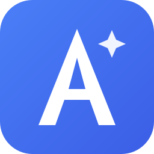
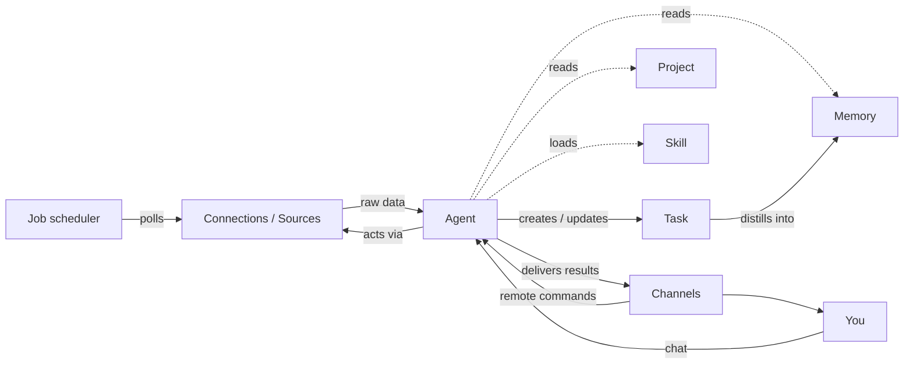

<div align="center">



# Aide

### Your personal work agent

Sees the full picture · learns as you work · helps you get things done

[](#project-status)
[](#under-the-hood)
[](#license)

[](https://houk-ms.github.io/aide/)

</div>

---

## What is Aide?

**Aide** is a local-first desktop agent for people who live inside a dozen work systems at once.

Your work is scattered across email, Teams, GitHub, meetings, and work items — and no single place shows you the whole picture. Most AI tools forget everything the moment a chat ends, so you spend five minutes setting up context for two minutes of help. And at day's end, there's no record of what you actually did.

Aide closes that gap — it sees your work whole, remembers it, and acts on it the way you would.

> One place to manage all your work. An agent that already knows your context, works while you're away, and reaches you wherever you are.

---

## How Aide helps

Three things, working as one:

| | |
|---|---|
| **Aggregate** | Pulls your tasks from every system — email, Teams, GitHub, meetings — into one prioritized view. Nothing slips through, and you stop tab-hopping. |
| **Understand** | Builds a lasting memory of your projects, people, and preferences. The more you work, the less you re-explain. |
| **Act** | Drafts, replies, reviews, and ships — through each tool's API, and by driving a browser when there's no API. It always asks before anything leaves your hands. |

It runs proactively in the background, reaches you across your messengers — WeChat, Telegram, Discord, WhatsApp — and keeps getting more capable as you install new Skills.

---

## A day with Aide

| Time | What happens |
|---|---|
| **8:30 AM** | Still on your commute. A morning briefing lands on WeChat: overnight email, Teams messages, GitHub notifications, and today's calendar, already triaged. You reply "snooze the vendor thread to Friday" — done, from your phone. |
| **9:00 AM** | Open the app. The same prioritized task list is waiting. Thirty seconds to know what matters today. |
| **10:00 AM** | A 30-minute Teams meeting ends. Aide pulls the action items from the notes, links them to the right project, and tags owners and deadlines — no manual capture. |
| **2:00 PM** | Open a task ("fix the pagination bug"). Aide already knows the project, the code structure, and the related issue discussion. It locates the bug, proposes a fix and tests, and opens a PR. |
| **3:00 PM** | "What did A conclude about that API change last week?" Aide answers straight from your email, Teams, and meeting history — no digging. |
| **6:00 PM** | Aide reconciles the day: tasks you handled yourself, things resolved before a task even existed. It updates statuses, generates your daily report, and delivers it wherever you asked — the app, your messengers, or both. |

---

## Why Aide is different

| | AI chat assistants | Autonomous agents | Task managers | Automation tools | **Aide** |
|---|:---:|:---:|:---:|:---:|:---:|
| Persistent task lifecycle | ✗ | ~ | ✓ | ✗ | **✓** |
| Learns you over time | ~ | ✓ | ✗ | ✗ | **✓** |
| Runs proactively | ✗ | ✓ | ✗ | ✓ | **✓** |
| Aggregates real work systems | ~ | ~ | ✗ | ✓ | **✓** |
| Judgment, not just rules | ✓ | ✓ | ✗ | ✗ | **✓** |
| Extends with new skills | ~ | ~ | ✗ | ✗ | **✓** |
| Reaches you off the desktop | ✗ | ~ | ✗ | ~ | **✓** |

Aide combines the **memory and judgment of an agent** with the **persistent task lifecycle of a task manager** and the **proactive execution of automation** — focused squarely on knowledge work, reachable wherever you are, and open-ended through installable skills.

---

## Core concepts

Aide is built around a small set of entities, all maintainable two ways: **by the agent** (from conversation or by discovering things in your information flow) and **by you** (directly in the UI).

- **Task** — the central entity. Everything revolves around it. Sourced from connections, scheduled jobs, or conversation.
- **Connection (Source)** — an external work system (Outlook, Teams, GitHub, Calendar, SharePoint…) that Aide reads work from and acts through.
- **Channel** — how Aide reaches you outside the app: the built-in Aide chat plus WeChat, Telegram, Discord, and WhatsApp. Delivers briefings and reports, and takes commands remotely.
- **Project** — a work project (repo, docs, wiki) that gives the agent background when handling tasks.
- **Skill** — an extensible capability unit, peer to MCP tools. Lets Aide's abilities be installed, published, and composed instead of hard-coded.
- **Job** — scheduled automation (morning aggregation, periodic polling, end-of-day reconciliation), with per-job control over which Channels receive its result.
- **Memory** — the agent's growing understanding of you: preferences, decisions, project progress, and people. Viewable, correctable, and deletable.



---

## Get started

### Download

The quickest way to try Aide — no toolchain required.

1. Download the installer for your platform from the [Releases page](https://github.com/houk-ms/aide/releases).
2. Run it and launch Aide.
3. Connect your accounts from **Settings → Connections**.

Aide reaches your work systems through two MCP servers:

- **Microsoft 365** via [`@microsoft/workiq`](https://github.com/microsoft/work-iq) — Outlook, Teams, Calendar, SharePoint/OneDrive, and People in one server.
- **GitHub** via the GitHub MCP Server — issues, PRs, repos, and notifications.

See [docs/connection.md](docs/connection.md) for setup details, including the Work IQ flag and admin-consent notes.

<details>
<summary><b>Run from source</b></summary>

<br>

**Prerequisites:** Node.js 20+ and npm.

```bash
npm install      # install dependencies
npm run dev      # run in development (hot reload)
npm run build    # build for production
npm run preview  # preview the production build
```

</details>

---

## Under the hood

Aide is a single local-first Electron app — your data stays on your machine. The main process hosts the agent, scheduler, connections, and storage; work systems connect through MCP servers, and capabilities extend through installable Skills. Memory is a three-layer design on local SQLite, no ML dependencies.

<details>
<summary><b>Architecture & tech stack</b></summary>

<br>

The **main process** hosts the agent (GitHub Copilot SDK), job scheduler, connections, and storage; the **renderer** delivers the task-list + chat workspace over typed IPC. Work systems connect through MCP servers (`@microsoft/workiq` for M365, the GitHub MCP Server, plus user-installed MCP), and capabilities extend through Skills (built-in / community / local). Memory is a three-layer design — L0 identity, L1 knowledge, L2 archive — on SQLite FTS5 with structured tags.

| Decision | Choice | Why |
|---|---|---|
| Product form | Local desktop app (Electron) | Personal tool, sensitive data, local-first |
| AI engine | GitHub Copilot SDK | Reasoning loop, tool orchestration, session persistence out of the box |
| External connections | MCP protocol | Standard tool/resource protocol with the largest ecosystem |
| Storage | Local SQLite + filesystem | No server needed; easy to migrate and back up |
| Language | TypeScript everywhere | One language across Electron, Copilot SDK, and MCP |
| UI | React 19 · Zustand · Tailwind CSS | Lightweight, fast to iterate |

See [docs/architecture.md](docs/architecture.md) and [docs/memory.md](docs/memory.md) for the full design.

</details>

---

## Documentation

| Doc | What it covers |
|---|---|
| [PRODUCT.md](PRODUCT.md) | Product definition, target user, positioning, roadmap |
| [docs/architecture.md](docs/architecture.md) | System architecture, process model, storage |
| [docs/agent.md](docs/agent.md) | Agent engine: prompt assembly, tools, autonomy levels |
| [docs/memory.md](docs/memory.md) | Three-layer memory system |
| [docs/task.md](docs/task.md) | Task entity, state machine, dedup, prioritization |
| [docs/connection.md](docs/connection.md) | External connections (Work IQ + GitHub) |
| [docs/project.md](docs/project.md) | Project context |
| [docs/skill.md](docs/skill.md) | Skill extensibility model |
| [docs/job.md](docs/job.md) | Scheduling subsystem |
| [docs/ui.md](docs/ui.md) | UI design and interaction flows |

---

## Project status

Aide is in **early access**: the core experience is in place, while the agent-driven collection and execution paths continue to be hardened. See [PRODUCT.md](PRODUCT.md) for the full scope and what's next.

---

## License

Private project. All rights reserved.
