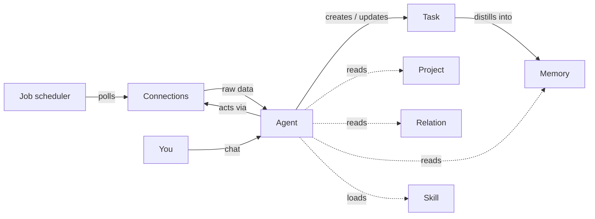

<div align="center">

# Aide

### Your personal work agent — sees the full picture, learns as you work, and helps you get things done.

[](#roadmap)
[](#tech-stack)
[](#tech-stack)
[](#tech-stack)
[](#license)

**[🌐 Visit the product homepage](https://houk-ms.github.io/aide/)**

</div>

---

## What is Aide?

**Aide** is a local-first desktop agent for people who live inside a dozen work systems at once.

Your work is scattered across email, Teams, GitHub, meetings, and work items — and no single place shows you the whole picture. Most AI tools forget everything the moment a chat ends, so you spend five minutes setting up context to get two minutes of help. And at the end of the day, there's no record of what you actually did.

Aide closes that gap. It **aggregates** your tasks from every system, **builds a lasting understanding** of your projects and people, and **helps you act** — drafting, replying, reviewing, and shipping — the way you would yourself.

> One place to manage all your work. An agent that already knows your context. Just tell it what you need.

---

## Why Aide is different

| | AI chat assistants | Autonomous agents | Task managers | Automation tools | **Aide** |
|---|:---:|:---:|:---:|:---:|:---:|
| Persistent task lifecycle | ✗ | ~ | ✓ | ✗ | **✓** |
| Learns you over time | ~ | ✓ | ✗ | ✗ | **✓** |
| Runs proactively | ✗ | ✓ | ✗ | ✓ | **✓** |
| Aggregates real work systems | ~ | ~ | ✗ | ✓ | **✓** |
| Judgment, not just rules | ✓ | ✓ | ✗ | ✗ | **✓** |

Aide combines the **memory and judgment of an agent** with the **persistent task lifecycle of a task manager** and the **proactive execution of automation** — focused squarely on knowledge work.

---

## A day with Aide

| Time | What happens |
|---|---|
| **9:00 AM** | Open the app. Aide has already gathered overnight email, Teams messages, GitHub notifications, and calendar events into a prioritized task list. Thirty seconds to know what matters today. |
| **10:00 AM** | A 30-minute Teams meeting ends. Aide pulls the action items from the notes, links them to the right project, and tags owners and deadlines — no manual capture. |
| **2:00 PM** | Open a task ("fix the pagination bug"). Aide already knows the project, the code structure, and the related issue discussion. It locates the bug, proposes a fix and tests, and opens a PR. |
| **3:00 PM** | "What did A conclude about that API change last week?" Aide answers straight from your email, Teams, and meeting history — no digging. |
| **6:00 PM** | Aide reconciles the day: tasks you handled yourself, things resolved before a task even existed. It updates statuses and generates your daily report. |

---

## Core concepts

Aide is built around a small set of entities, all maintainable two ways: **by the agent** (from conversation or by discovering things in your information flow) and **by you** (directly in the UI).

- **Task** — the central entity. Everything revolves around it. Sourced from connections, scheduled jobs, or conversation.
- **Connection** — an external work system (Outlook, Teams, GitHub, Calendar, SharePoint…). Both a source of tasks and a channel to act through.
- **Project** — a work project (repo, docs, wiki) that gives the agent background when handling tasks.
- **Relation** — your network of people, with roles and communication preferences, so the agent can judge priority and pick the right channel.
- **Skill** — an extensible capability unit, peer to MCP tools. Lets Aide's abilities be installed, published, and composed instead of hard-coded.
- **Job** — scheduled automation (morning aggregation, periodic polling, end-of-day reconciliation).
- **Memory** — the agent's growing understanding of you: preferences, decisions, project progress, and people. Viewable, correctable, and deletable.



---

## Architecture

Aide is a single Electron app: a **main process** that hosts the agent, scheduler, connections, and storage, and a **renderer** that delivers the task-list + chat workspace.

```
┌──────────────────────────────────────────────┐
│ Electron Main Process                         │
│                                               │
│  Agent (Copilot SDK)   Job Scheduler          │
│  Connection Manager    Memory Store           │
│  Task Store            SQLite DB               │
│                                               │
│  MCP Servers:                                 │
│   • @microsoft/workiq  (full M365)            │
│   • GitHub MCP Server                          │
│   • User-installed MCP (from registry)        │
│  Skills: built-in / community / local         │
└──────────────────────┬───────────────────────┘
                       │ typed IPC
┌──────────────────────▼───────────────────────┐
│ Electron Renderer Process                     │
│   [Task List]  │  [Chat Panel]                │
│   React + Zustand + Tailwind CSS              │
└───────────────────────────────────────────────┘
```

**The memory system** uses a three-layer design — no ML dependencies, just SQLite FTS5 + structured tags:

| Layer | Name | Role | Loading |
|---|---|---|---|
| **L0** | Identity | Core profile (1K char hard limit) | Injected into every system prompt |
| **L1** | Knowledge | Long-term facts, conventions, lessons | Retrieved per turn (top-K) |
| **L2** | Archive | Historical record of tasks and sessions | Retrieved on demand |

See [docs/architecture.md](docs/architecture.md) and [docs/memory.md](docs/memory.md) for the full design.

---

## Tech stack

| Decision | Choice | Why |
|---|---|---|
| Product form | Local desktop app (Electron) | Personal tool, sensitive data, local-first |
| AI engine | GitHub Copilot SDK | Reasoning loop, tool orchestration, session persistence out of the box |
| External connections | MCP protocol | Standard tool/resource protocol with the largest ecosystem |
| Storage | Local SQLite + filesystem | No server needed; easy to migrate and back up |
| Language | TypeScript everywhere | One language across Electron, Copilot SDK, and MCP |
| UI | React 19 · Zustand · Tailwind CSS | Lightweight, fast to iterate |

---

## Getting started

### Option 1: Download a release

The quickest way to try Aide — no toolchain required.

1. Go to the [Releases page](https://github.com/houk-ms/aide/releases) and download the installer for your platform.
2. Run the installer and launch Aide.
3. Connect your accounts from **Settings → Connections** (see below).

### Option 2: Run from source

> **Prerequisites:** Node.js 20+ and npm.

```bash
# Install dependencies
npm install

# Run in development (hot reload)
npm run dev

# Build for production
npm run build

# Preview the production build
npm run preview
```

### Connecting your accounts

Aide talks to your work systems through two MCP servers:

- **Microsoft 365** via [`@microsoft/workiq`](https://github.com/microsoft/work-iq) — Outlook, Teams, Calendar, SharePoint/OneDrive, and People in a single server.
- **GitHub** via the GitHub MCP Server — issues, PRs, repos, and notifications.

Authorize them from **Settings → Connections**. See [docs/connection.md](docs/connection.md) for setup details, including the Work IQ experimental flag and admin-consent notes.

---

## Documentation

| Doc | What it covers |
|---|---|
| [PRODUCT.md](PRODUCT.md) | Product definition, target user, positioning, roadmap |
| [docs/architecture.md](docs/architecture.md) | System architecture, process model, storage |
| [docs/agent.md](docs/agent.md) | Agent engine: prompt assembly, tools, autonomy levels |
| [docs/memory.md](docs/memory.md) | Three-layer memory system |
| [docs/task.md](docs/task.md) | Task entity, state machine, dedup, prioritization |
| [docs/connection.md](docs/connection.md) | External connections (Work IQ + GitHub) |
| [docs/project.md](docs/project.md) | Project context |
| [docs/relation.md](docs/relation.md) | People and working relationships |
| [docs/skill.md](docs/skill.md) | Skill extensibility model |
| [docs/job.md](docs/job.md) | Scheduling subsystem |
| [docs/ui.md](docs/ui.md) | UI design and interaction flows |
| [docs/feature-list.md](docs/feature-list.md) | Feature inventory and implementation audit |

---

## Roadmap

The full scope defined in [PRODUCT.md](PRODUCT.md) is the MVP — the goal is to use Aide for real daily work. Beyond MVP:

- **Permission system** — configurable autonomy by action type and source
- **External channels** — receive instructions and reports via WeChat / Telegram / Slack
- **Self-improvement** — the agent learns from feedback and maintains its own skills
- **Proactive heartbeat** — periodic check-ins that surface things worth your attention
- **Browser & system control** — Playwright/CDP automation, file and Office operations
- **Screen understanding & computer use** — operate any GUI, even apps without an API
- **Workflow orchestration** — compose multi-step actions into reusable workflows

---

## Project status

Aide is an **MVP in active development**. The app shell, task list, chat, settings, SQLite schema, and core CRUD are in place; the agent-driven collection and execution paths are being hardened. See [docs/feature-list.md](docs/feature-list.md) for a candid, per-feature audit.

---

## License

Private project. All rights reserved.
